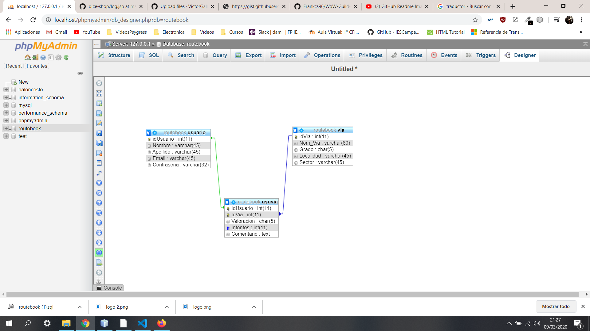
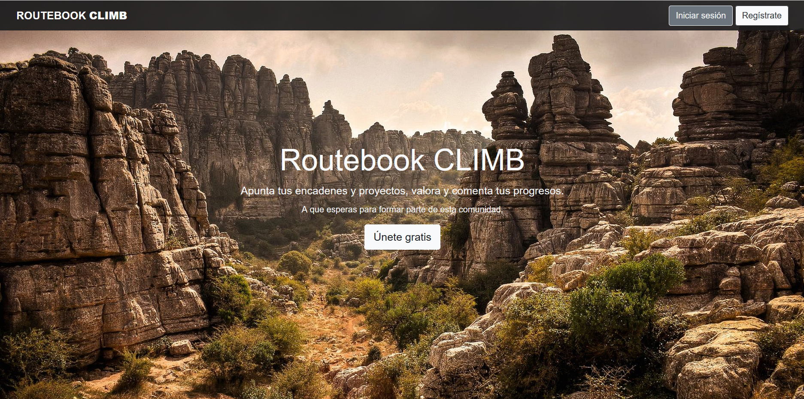
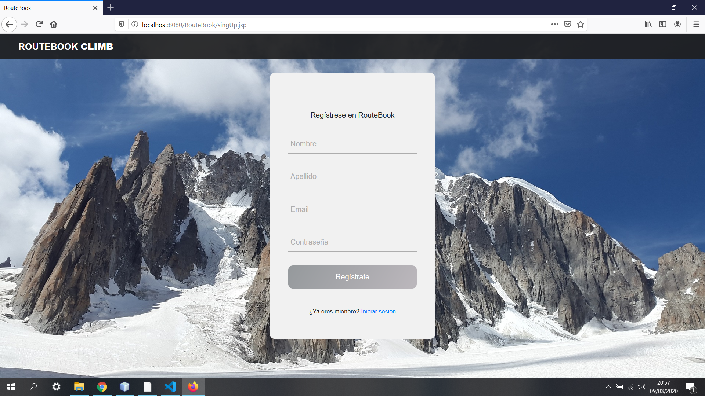
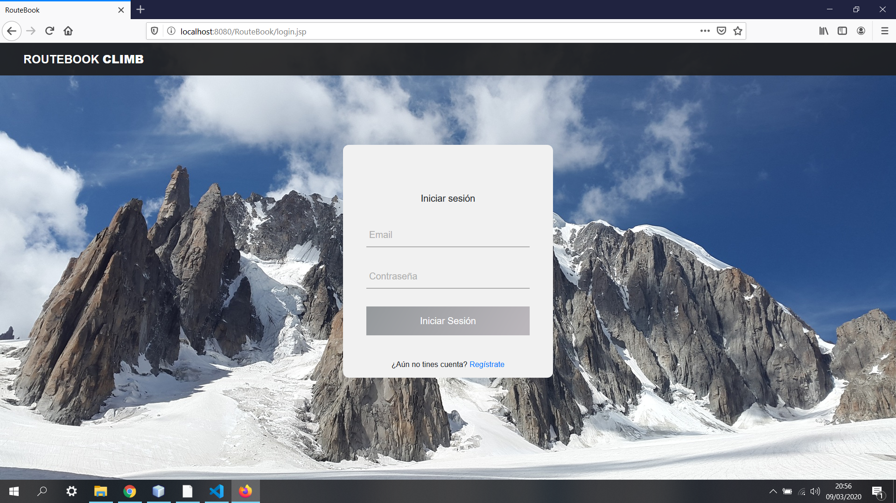
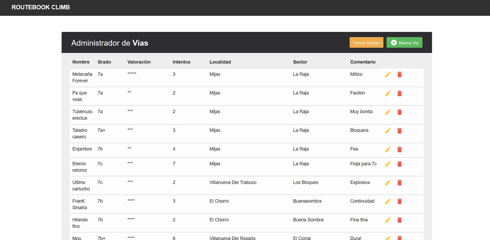
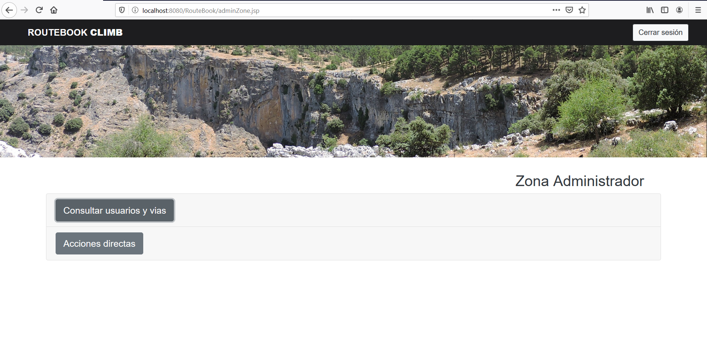
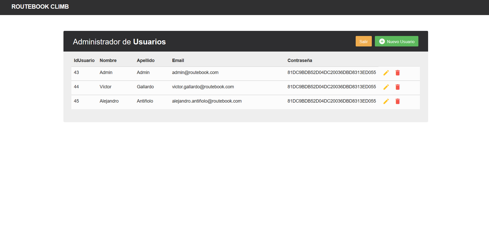
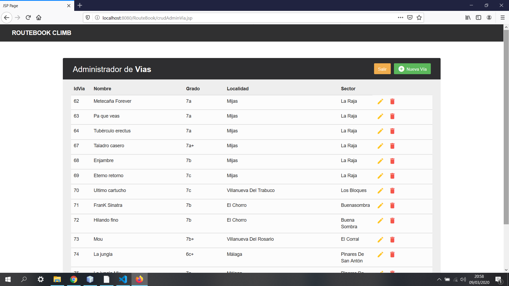
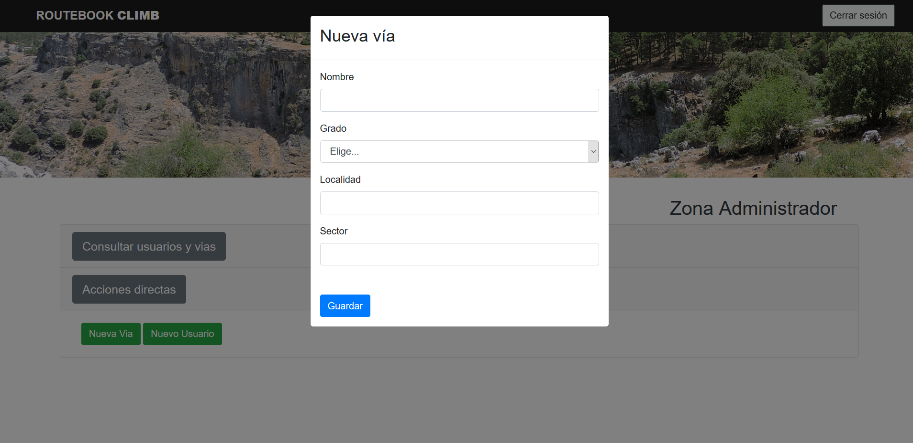

**Aplicación Web para registrar y almacenar todas tus vías de escalada, ya sean proyectos o encadenes.**
Este proyecto ha sido creado para la asignatura de programación del curso de desarrollo de aplicaciones multiplataforma
del Instituto IES Campanillas.

Cuentas para pruebas: "admin@routebook.com"            contraseña: 1234
                     "victor.gallardo@routebook.com"  contraseña: 1234

## BASE DE DATOS creada con **Workbench**

Base de datos bastante sencilla con una relacion N:M en la que tenemos tres tablas: Usuarios, Vías y usuvia, esta ultima 
es la que almacena datos que guardan relación entre un usuario y una vía.

## Inicio

De entrada nos encontramos con la pagina principal en la que podemos iniciar sesión o registrarnos, un boton central nos redirige 
también al registro de la aplicación.

## Registro

Si pulsamos la opción de registro nos redirige al formulario de registro en el que hay que rellenar los campos para poder registrarnos

## Login 

Accederemos a nuestra cuenta mediante el email y contraseña. O bien siendo administrador a la zona de administrador que veremos más adelante.

## Zona de usuario

CRUD que combina dos tablas para tener almacenadas las vias de cada usuario las relaciona mediante las llaves primarias de la tabla usuario y via siendo foraneas en usuvia. Podemos gestionar nuestras vías y apuntar nuevas que vayamos realizando.

## Zona administrador

Si bien he dicho antes al acceder mediante la cuenta de usuario admin@routebook.com contraseña: 1234 accederemos a la zona de usuario en la que en un primer panel veremos diferentes acciones que podemos realizar. Podemos acceder a los usuarios, vias o bien insertar usuarios o vias.

Si consultamos usuarios y vias, accedemos a la admistración de los mismos.

Si consultamos acciones directas, accedemos a la inserción de usuarios o vías.

                      

